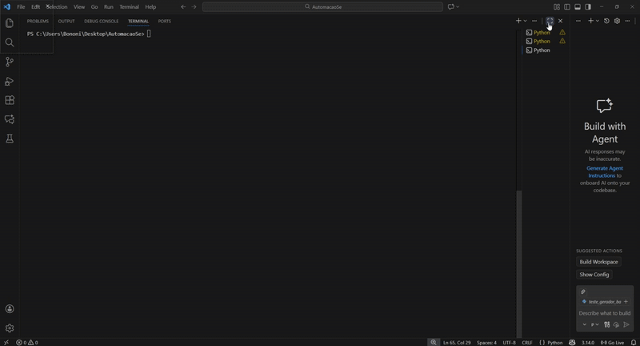
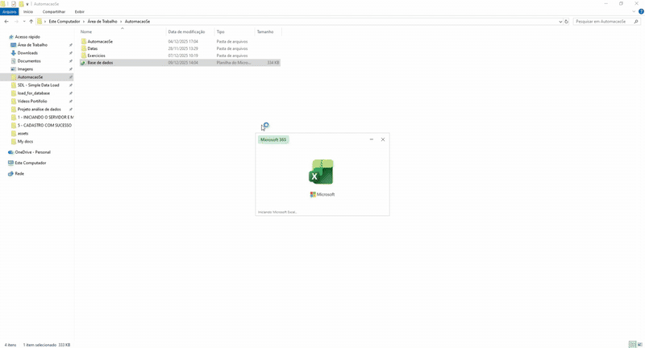

# 📊 ETL

## 📌 Objetivo
Criar uma base dados para o sistema de Joias publicado no projeto passado e
fazer a carga desse insumo para o banco de dados.

🚀 1 — Gerando a base para poder carregar

Aqui eu mostro o código funcionando:

Ele me pede os parâmetros como:

- Quantidade de linhas do arquivo
- Quantidade de colunas do arquivo
- Nome do arquivo

depois para cada coluna ele pergunta:

- Qual tipo de dado quer inputar (texto, int, data)
- depois pergunta o range de dados

  

Resultado:

  

2 — Mostrando a carga em execução

No gif abaixo, mostro a consulta ao banco de dados com somente 14 registros
e depois mostro a quantidade de registros após a carga em Python.

  

## 🧰 Ferramentas
- Python
- SQL Server
- Excel

O proximo projeto será uma análise completa no PowerBI a partir dos insumos desse projeto

Fique ligado !
